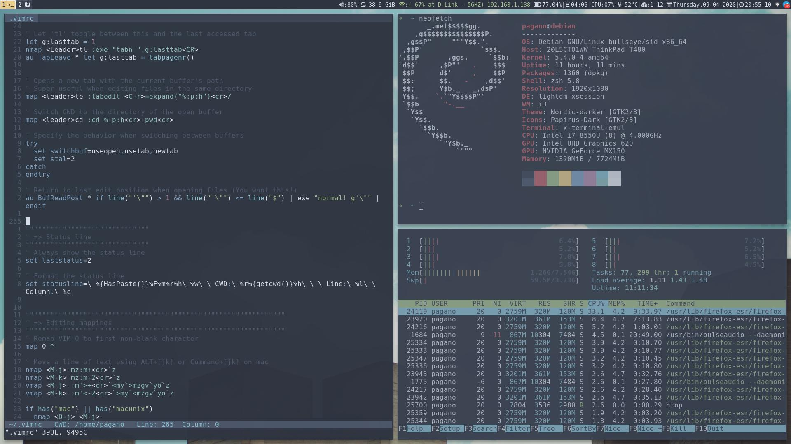
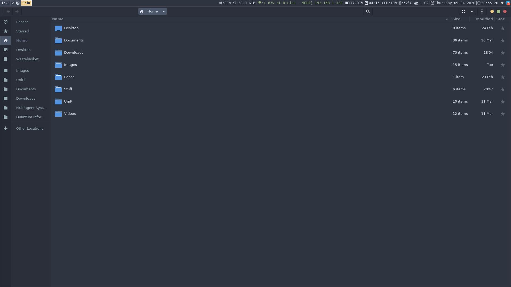
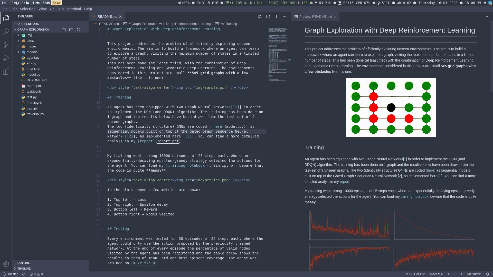

# My dotfiles

I [nord](https://github.com/arcticicestudio/nord)'ed pretty much everything on my i3-gaps config.

## Terminal / Vim

I use urxvt + vim

## File Manager

I use both Nautilus and Ranger

## Text Editor

I use [VSCodium](https://github.com/VSCodium/vscodium)

##

... README in progress
